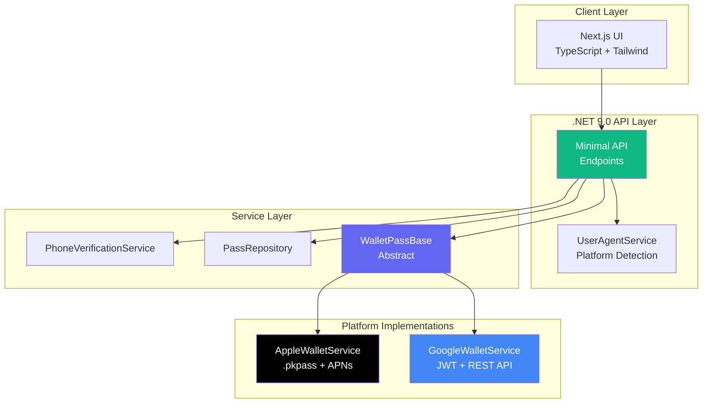
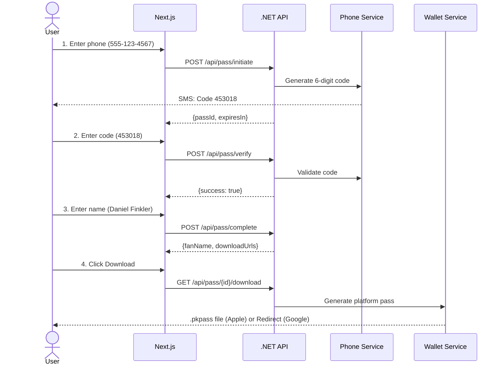
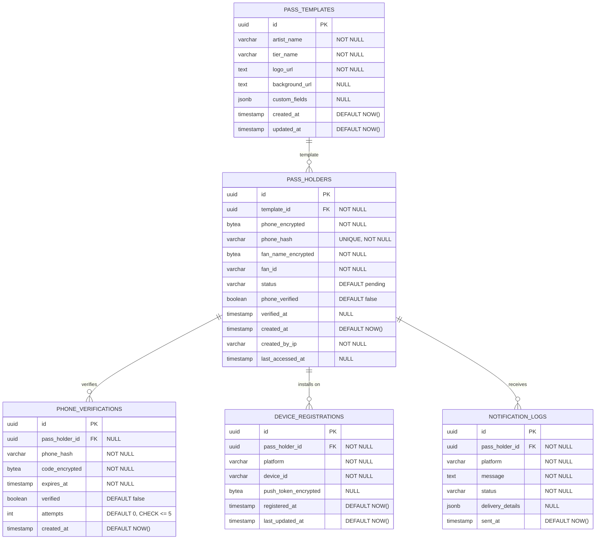

# FanPad Wallet Pass - Technical Implementation

> **Author:** Daniel Finkler  
> **Date:** October 2025  
> **Stack:** .NET 9.0 API + Next.js 15 TypeScript  
> **Go-Live:** December 15, 2025

## Overview

A mobile wallet pass system enabling direct push notifications to fans without app installation. Demonstrates production-ready architecture with platform abstraction (Apple Wallet + Google Wallet), phone verification flow, and smart User-Agent detection.

**Demo:** http://localhost:3000 | **API Docs:** http://localhost:5076/scalar/v1

---

## Quick Start

**Prerequisites:**
- .NET 9.0 SDK ([download](https://dotnet.microsoft.com/download))
- Node.js 20+ with Yarn 4

```bash
# Install dependencies
yarn install              # Root: installs concurrently
cd fanpad-wallet-ui && yarn install && cd ..  # Frontend dependencies

# Start both API + UI (NuGet packages auto-restore on first run)
yarn dev
```

**Access Points:**
- Frontend: http://localhost:3000
- API: http://localhost:5076
- Scalar Docs: http://localhost:5076/scalar/v1
- Run Tests: `yarn test` (24 unit tests)

---

## Solution Architecture

### High-Level Design



### 4-Step User Flow



---

## API Endpoints

### Core Flow

| Endpoint | Method | Purpose |
|----------|--------|---------|
| `/api/pass/initiate` | POST | Send SMS verification code |
| `/api/pass/verify` | POST | Verify code (step 1) |
| `/api/pass/complete` | POST | Add fan name (step 2) |
| `/api/pass/{id}/download` | GET | Download platform-specific pass |
| `/api/pass/{id}/notify` | POST | Send push notification |

### Example: Initiate Flow

**Request:**
```json
POST /api/pass/initiate
{
  "phone": "+15551234567",
  "artistId": "a1b2c3d4-e5f6-4789-a1b2-c3d4e5f67890"
}
```

**Response:**
```json
{
  "passId": "f47ac10b-58cc-4372-a567-0e02b2c3d479",
  "message": "Verification code sent to +15***4567",
  "expiresIn": 600
}
```

**Demo Mode:** Code logged to console: `Code: 453018`

### Example: Phone Verification + Complete User Association

**Step 1 - Verify Code Only:**
```json
POST /api/pass/verify
{
  "passId": "f47ac10b-...",
  "code": "453018"
}
→ {success: true, message: "Phone verified"}
```

**Step 2 - Complete with Name:**
```json
POST /api/pass/complete
{
  "passId": "f47ac10b-...",
  "fanName": "Daniel Finkler"
}
→ {success: true, fanName: "Daniel Finkler", downloadUrls: {...}}
```

---

## Platform Abstraction Pattern

### Design Decision

Key architectural requirement: isolate platform-specific complexity while maintaining a unified API interface.

### Abstract Base Class

```csharp
public abstract class WalletPassBase
{
    public abstract string PlatformName { get; }
    
    public abstract Task<PassFile> GeneratePass(PassData data);
    
    public abstract Task<Result<NotificationDetail>> SendPushNotification(
        string deviceId, Guid passId, string message);
}
```

### Apple Implementation (Stub)

```csharp
public class AppleWalletService : WalletPassBase
{
    public override string PlatformName => "apple";
    
    public override async Task<PassFile> GeneratePass(PassData data)
    {
        // Production: Create pass.json with pass data
        // Download images (logo.png, icon.png, background.png)
        // Generate manifest.json with SHA1 hashes
        // Sign with P12 certificate
        // Create .pkpass ZIP archive
        
        var stubPassBytes = Encoding.UTF8.GetBytes($"STUB .pkpass for {data.FanName}");
        
        return new PassFile(
            FileName: $"{data.ArtistName.ToLower()}-pass.pkpass",
            ContentType: "application/vnd.apple.pkpass",
            Data: stubPassBytes
        );
    }
    
    // Push via APNs - device fetches updated pass
}
```

### Google Implementation (Stub)

```csharp
public class GoogleWalletService : WalletPassBase
{
    public override string PlatformName => "google";
    
    public override async Task<PassFile> GeneratePass(PassData data)
    {
        // Production: Create JWT with pass object
        // Sign with service account key
        // Generate save URL
        
        var saveUrl = $"https://pay.google.com/gp/v/save/{{JWT_TOKEN}}";
        
        return new PassFile(
            FileName: "google-wallet-redirect",
            ContentType: "text/plain",
            Data: Encoding.UTF8.GetBytes(saveUrl),
            RedirectUrl: saveUrl  // Browser redirect
        );
    }
    
    // Push via REST API - direct object update
}
```

### Platform Comparison

| Aspect | Apple Wallet | Google Wallet |
|--------|-------------|---------------|
| **Format** | `.pkpass` (signed ZIP) | JWT + URL redirect |
| **Signing** | P12 certificate | Service account JSON |
| **Push** | APNs → device fetches | REST API → direct update |
| **Setup Time** | 2-3 days | 3-4 days |

---

## Smart Platform Detection

### UserAgentService - Hybrid Strategy

```csharp
public PlatformDetectionResult DetectPlatform(
    HttpContext context, 
    string? explicitPlatform = null)
{
    // Priority 1: Explicit parameter (100% confidence)
    if (!string.IsNullOrEmpty(explicitPlatform))
        return Explicit(explicitPlatform);
    
    // Priority 2: User-Agent analysis (50-95% confidence)
    var userAgent = context.Request.Headers["User-Agent"];
    return AnalyzeUserAgent(userAgent);
    
    // Priority 3: Default fallback (Apple, 0% confidence)
}
```

**Detection Rules:**
- `iPhone|iPad` → Apple (95% confidence)
- `Android` + `Mobile` → Google (90% confidence)
- `Macintosh` → Apple heuristic (75% confidence)
- `Safari` → Apple hint (70% confidence)

**Logging:**
```
Pass {id} download: Platform=Apple, Method=Heuristic, 
Confidence=75%, Source=macOS desktop
```

---

## Security & Data Protection

### Phone Verification Security

```csharp
public class PhoneVerificationService
{
    private readonly ConcurrentDictionary<string, VerificationCode> _codes;
    
    // Rate limiting: 3 attempts per code
    // Code expiration: 10 minutes
    // Phone masking: +15***4567 in logs
    
    private string GenerateCode() 
        => Random.Shared.Next(100000, 999999).ToString();
    
    private string MaskPhoneNumber(string phone)
        => phone.Length < 4 ? "***" : $"{phone[..3]}***{phone[^4..]}";
}
```

### Data Protection Strategy

**Production Recommendations:**
- **Database:** PostgreSQL with encrypted PII columns (AES-256)
- **Cache:** Redis for verification codes with TTL
- **Secrets:** AWS Secrets Manager for certificates
- **Logging:** Structured logging with PII masking
- **Compliance:** GDPR-compliant data retention and deletion

---

## Database Design (Production)

### Design Principles

**1. Security First**
- PII encrypted at rest (AES-256)
- Phone numbers hashed (SHA-256) for duplicate detection
- Push tokens encrypted
- No plain-text sensitive data

**2. CMMI5 Compliance**
- Comprehensive audit trails
- Data retention policies (GDPR Article 17 - Right to erasure)
- Access logging for all PII queries
- Soft deletes with anonymization

**3. Performance & Scale**
- Strategic indexing for common queries
- Partitioning strategy for high-volume tables
- Efficient JOIN patterns
- Redis caching for verification codes

### Entity Relationship Diagram

**Note:** Demo schema shown. Production version will most likely link to external "artist" table on `artist_id`.



### Table Specifications

#### 1. pass_templates
**Purpose:** Artist/event pass configurations (template approach for reusability)

```sql
-- Example artists table
CREATE TABLE artists (
    id UUID PRIMARY KEY DEFAULT gen_random_uuid(),
    name VARCHAR(255) NOT NULL UNIQUE,
    slug VARCHAR(255) NOT NULL UNIQUE,  -- URL-friendly: "voila"
    bio TEXT,
    website_url TEXT,
    social_links JSONB,
    is_active BOOLEAN NOT NULL DEFAULT TRUE,
    created_at TIMESTAMP NOT NULL DEFAULT NOW(),
    updated_at TIMESTAMP NOT NULL DEFAULT NOW()
);

CREATE INDEX idx_artists_slug ON artists(slug);
CREATE INDEX idx_artists_active ON artists(is_active) WHERE is_active = TRUE;

-- Templates reference artists by ID
CREATE TABLE pass_templates (
    id UUID PRIMARY KEY DEFAULT gen_random_uuid(),
    artist_id UUID NOT NULL REFERENCES artists(id), 
    tier_name VARCHAR(100) NOT NULL,
    logo_url TEXT NOT NULL,
    background_url TEXT,
    custom_fields JSONB,
    
    -- Soft delete support
    is_deleted BOOLEAN NOT NULL DEFAULT FALSE,
    deleted_at TIMESTAMP,
    deleted_by VARCHAR(100),
    
    -- Audit trail
    created_at TIMESTAMP NOT NULL DEFAULT NOW(),
    updated_at TIMESTAMP NOT NULL DEFAULT NOW(),
    created_by VARCHAR(100),
    
    CONSTRAINT unique_artist_tier UNIQUE (artist_id, tier_name)
);

-- Indexes
CREATE INDEX idx_pass_templates_artist 
    ON pass_templates(artist_id) 
    WHERE is_deleted = FALSE;  -- FK + active templates only

CREATE INDEX idx_pass_templates_active 
    ON pass_templates(is_deleted, updated_at DESC);  -- Cache warming

CREATE INDEX idx_pass_templates_custom_fields 
    ON pass_templates USING gin(custom_fields);  -- JSONB queries
```

**Design Notes:**
- **Soft deletes:** Preserve historical templates for audit/reporting while hiding from active queries
- **Why soft delete?** 
  - Existing pass_holders still reference old templates (foreign key integrity)
  - Historical reporting ("How many 2024 VIP passes were issued?")
  - Re-activation if artist returns to platform
  - Compliance (retain data for N years)
- **Partial indexes:** Exclude deleted templates from common queries (performance boost)
- **GIN index:** Enables fast JSONB queries (`WHERE custom_fields @> '{"tier": "vip"}'`)

**JSONB custom_fields Examples:**
```json
{
  "theme": {
    "primaryColor": "#6366f1",
    "secondaryColor": "#8b5cf6",
    "backgroundColor": "#000000",
    "textColor": "#ffffff",
    "fontFamily": "Helvetica Neue"
  },
  "branding": {
    "socialLinks": {
      "instagram": "@voilamusic",
      "twitter": "@voilaofficial",
      "spotify": "spotify:artist:abc123"
    },
    "websiteUrl": "https://voilamusic.com"
  },
  "features": {
    "qrCodeEnabled": true,
    "nfcEnabled": false,
    "geoFenceEnabled": true,
    "geoFenceRadius": 500
  },
  "eventData": {
    "venue": "Madison Square Garden",
    "city": "New York",
    "eventDate": "2025-12-15T20:00:00Z",
    "doors": "19:00",
    "seatSection": "VIP",
    "accessLevel": ["backstage", "meet-greet", "vip-lounge"]
  },
  "promotions": {
    "discountCode": "EARLYBIRD25",
    "merchandiseCredit": 50,
    "exclusiveContent": ["unreleased-track-1", "behind-scenes-video"]
  },
  "notifications": {
    "enabled": true,
    "types": ["tour-dates", "merch-drops", "exclusive-content"],
    "quietHours": {"start": "22:00", "end": "08:00"}
  }
}
```

**Querying JSONB:**
```sql
-- Find all VIP templates with backstage access
SELECT * FROM pass_templates
WHERE custom_fields @> '{"eventData": {"accessLevel": ["backstage"]}}';

-- Find templates with specific theme color
SELECT * FROM pass_templates
WHERE custom_fields->>'theme'->>'primaryColor' = '#6366f1';

-- Get all notification-enabled templates
SELECT * FROM pass_templates
WHERE (custom_fields->'notifications'->>'enabled')::boolean = true;
```

---

#### 2. pass_holders
**Purpose:** Individual fan passes with encrypted PII

```sql
CREATE TABLE pass_holders (
    id UUID PRIMARY KEY DEFAULT gen_random_uuid(),
    template_id UUID NOT NULL REFERENCES pass_templates(id),  -- INDEX (FK + reporting)
    
    -- Phone number split for analytics
    country_code VARCHAR(5) NOT NULL,  -- INDEX (BI/analytics) e.g., "+1", "+44", "+86"
    phone_national_encrypted BYTEA NOT NULL,  -- National number only (encrypted)
    phone_hash VARCHAR(64) NOT NULL,  -- UNIQUE INDEX (full phone hash for duplicate check)
    
    -- Encrypted PII (AES-256)
    fan_name_encrypted BYTEA NOT NULL,
    
    -- Public identifier (non-sensitive)
    fan_id VARCHAR(20) NOT NULL,  -- INDEX (customer lookup)
    
    -- Status tracking
    status VARCHAR(20) NOT NULL DEFAULT 'pending',  -- INDEX (filtering)
    phone_verified BOOLEAN NOT NULL DEFAULT FALSE,
    verified_at TIMESTAMP,
    
    -- Audit trail
    created_at TIMESTAMP NOT NULL DEFAULT NOW(),  -- INDEX (reporting, pagination)
    created_by_ip VARCHAR(45) NOT NULL,  -- IPv4/IPv6 (security audit)
    last_pass_download_at TIMESTAMP,  -- Track engagement, identify inactive passes
    
    CONSTRAINT unique_phone_hash UNIQUE (phone_hash),
    CONSTRAINT unique_fan_id UNIQUE (fan_id),
    CONSTRAINT check_status CHECK (status IN ('pending', 'active', 'deleted'))
);

-- Indexes (annotated with purpose)
CREATE UNIQUE INDEX idx_pass_holders_phone_hash 
    ON pass_holders(phone_hash);  -- Duplicate prevention, O(1) lookup

CREATE INDEX idx_pass_holders_fan_id 
    ON pass_holders(fan_id);  -- Customer service lookups ("Find pass by fan ID")

CREATE INDEX idx_pass_holders_country_code 
    ON pass_holders(country_code, created_at DESC);  -- Geographic analytics

CREATE INDEX idx_pass_holders_status 
    ON pass_holders(status, created_at DESC) 
    WHERE status != 'deleted';  -- Filter active passes, sort by newest

CREATE INDEX idx_pass_holders_created 
    ON pass_holders(created_at DESC);  -- Pagination, reporting, analytics

CREATE INDEX idx_pass_holders_inactive 
    ON pass_holders(last_pass_download_at) 
    WHERE last_pass_download_at < NOW() - INTERVAL '90 days';  -- Stale pass cleanup

CREATE INDEX idx_pass_holders_template_status 
    ON pass_holders(template_id, status) 
    WHERE status != 'deleted';  -- "Active passes for this template" (covers template FK)

CREATE INDEX idx_pass_holders_verified_at 
    ON pass_holders(verified_at DESC) 
    WHERE phone_verified = TRUE;  -- Time-to-verify analytics

CREATE INDEX idx_pass_holders_phone_verified 
    ON pass_holders(phone_verified, created_at DESC) 
    WHERE status != 'deleted';  -- Scan verified vs unverified passes

CREATE INDEX idx_pass_holders_created_by_ip 
    ON pass_holders(created_by_ip);  -- Abuse detection / rate limiting support
```

**Design Notes:**

**Why Separate Country Code?**

**1. Business Intelligence (BI) - No PII Exposure**
```sql
-- Geographic distribution (no decryption needed!)
SELECT 
    country_code,
    COUNT(*) as total_passes,
    COUNT(CASE WHEN phone_verified THEN 1 END) as verified_passes,
    ROUND(100.0 * COUNT(CASE WHEN phone_verified THEN 1 END) / COUNT(*), 2) as verification_rate
FROM pass_holders
WHERE status = 'active'
GROUP BY country_code
ORDER BY total_passes DESC;

/* Results:
 country_code | total_passes | verified_passes | verification_rate
--------------+--------------+-----------------+------------------
 +1           | 45,230       | 43,105          | 95.30
 +44          | 12,450       | 11,890          | 95.50
 +86          | 8,920        | 8,102           | 90.83
 +33          | 5,670        | 5,401           | 95.26
*/
```

**2. SMS Provider Routing**
```sql
-- Route SMS by country for optimal delivery + cost
SELECT country_code, COUNT(*) 
FROM pass_holders 
WHERE phone_verified = FALSE AND created_at > NOW() - INTERVAL '1 hour'
GROUP BY country_code;
```

**3. Compliance & Data Residency**
```sql
-- Identify users subject to specific regulations
SELECT COUNT(*) 
FROM pass_holders 
WHERE country_code IN ('+33', '+49', '+39')  -- France, Germany, Italy (GDPR)
  AND status = 'active';

-- Data residency requirements
SELECT country_code, COUNT(*)
FROM pass_holders
WHERE country_code IN ('+86', '+7')  -- China, Russia (local storage requirements)
GROUP BY country_code;
```

**4. Cost Optimization**
```sql
-- SMS cost analysis (prices vary dramatically by country)
SELECT 
    country_code,
    COUNT(*) as codes_sent,
    CASE 
        WHEN country_code = '+1' THEN COUNT(*) * 0.0075  -- US: $0.0075/SMS
        WHEN country_code IN ('+44', '+33', '+49') THEN COUNT(*) * 0.01  -- EU: $0.01/SMS
        WHEN country_code = '+86' THEN COUNT(*) * 0.05  -- China: $0.05/SMS
        ELSE COUNT(*) * 0.02
    END as estimated_cost_usd
FROM phone_verifications
WHERE created_at >= DATE_TRUNC('month', NOW())
GROUP BY country_code
ORDER BY estimated_cost_usd DESC;
```

**5. User Experience**
```typescript
// Pre-populate country code based on user's IP geolocation
const detectCountryCode = async (ipAddress: string): Promise<string> => {
    const geoData = await geoIPLookup(ipAddress);
    return geoData.countryCode;  // e.g., "US" -> "+1"
};

// Show country-specific formatting hints
if (countryCode === '+1') {
    placeholder = '(555) 123-4567';  // North American format
} else if (countryCode === '+44') {
    placeholder = '07700 900123';    // UK format
}
```

**Index Strategy Explained:**
1. **`phone_hash` (UNIQUE)** - Prevents duplicate passes (hash includes country code + national number)
2. **`fan_id` (UNIQUE)** - Customer service: "Find pass by fan ID FP0123456"
3. **`country_code + created_at`** - Geographic analytics, time-series by region
4. **`status + created_at` (partial)** - Composite for filtered lists: "Show active passes, newest first"
5. **`created_at`** - General reporting, time-series analysis, pagination
6. **`inactive` (partial)** - Identify stale passes for engagement campaigns
7. **`template_status` (partial)** - "Active passes for this template" (covers template_id FK)
8. **`verified_at` (partial)** - Time-to-verify analytics
9. **`phone_verified` (composite, partial)** - Scan verified vs unverified passes with sort
10. **`created_by_ip`** - Abuse detection / rate limiting support

**Column Clarifications:**
- **`country_code`** - NOT PII, enables analytics without decryption
  - Examples: "+1" (US/Canada), "+44" (UK), "+86" (China), "+33" (France)
  - **Analytics:** Geographic distribution of users, growth trends by region
  - **Operations:** SMS provider routing, cost optimization
  - **Compliance:** Data residency, regional regulations
- **`phone_national_encrypted`** - Only the national number (encrypted)
  - C# property: `NationalNumber` (following libphonenumber standard terminology)
  - "+1 555-123-4567" splits to: country_code="+1", phone_national_encrypted=encrypt("5551234567")
  - Smaller encrypted payload (no country code)
- **`phone_hash`** - SHA-256(country_code + national_number) for duplicate detection
  - Still checks full phone number uniqueness
  - Example: SHA256("+15551234567")
- **`last_pass_download_at`** - Tracks when user last downloaded/accessed their pass
  - **Use case 1:** Security - detect dormant accounts
  - **Use case 2:** Engagement - trigger re-engagement campaign if >90 days inactive
  - **Use case 3:** Cleanup - soft delete passes with no activity >1 year
  - **Use case 4:** Analytics - measure pass adoption rate
- **`fan_id`** - Public-facing identifier (e.g., "FP0123456")
  - Safe to display in UI, customer support tickets, QR codes
- **IPv6 support** - VARCHAR(45) handles both IPv4 and IPv6 addresses

**Real-World Analytics Examples:**
```sql
-- Geographic distribution of active users
SELECT 
    country_code,
    COUNT(*) as total_users,
    COUNT(*) * 100.0 / SUM(COUNT(*)) OVER () as user_distribution_pct,
    COUNT(CASE WHEN created_at >= NOW() - INTERVAL '30 days' THEN 1 END) as recent_signups
FROM pass_holders
WHERE status = 'active'
GROUP BY country_code
ORDER BY total_users DESC;

/* Example Output:
 country_code | total_users | user_distribution_pct | recent_signups
--------------+-------------+-----------------------+----------------
 +1           | 45,230      | 68.2                  | 3,421
 +44          | 12,450      | 18.8                  | 892
 +86          | 8,920       | 13.5                  | 1,203
*/

-- Growth trajectory by region (signup velocity)
SELECT 
    DATE_TRUNC('month', created_at) as month,
    country_code,
    COUNT(*) as new_passes,
    ROUND(AVG(COUNT(*)) OVER (
        PARTITION BY country_code 
        ORDER BY DATE_TRUNC('month', created_at) 
        ROWS BETWEEN 2 PRECEDING AND CURRENT ROW
    ), 0) as three_month_avg
FROM pass_holders
WHERE created_at >= NOW() - INTERVAL '12 months'
GROUP BY DATE_TRUNC('month', created_at), country_code
ORDER BY month DESC, new_passes DESC;

-- Verification success rate by country (operational metric)
SELECT 
    country_code,
    COUNT(*) as total_passes,
    COUNT(CASE WHEN phone_verified THEN 1 END) as verified_count,
    ROUND(100.0 * COUNT(CASE WHEN phone_verified THEN 1 END) / COUNT(*), 1) as verification_rate_pct,
    ROUND(AVG(CASE 
        WHEN phone_verified AND verified_at IS NOT NULL 
        THEN EXTRACT(EPOCH FROM (verified_at - created_at)) / 60 
    END), 1) as avg_minutes_to_verify
FROM pass_holders
WHERE status = 'active'
GROUP BY country_code
HAVING COUNT(*) >= 100  -- Only countries with sufficient data
ORDER BY total_passes DESC;

-- Verification funnel analysis (uses idx_pass_holders_phone_verified)
SELECT 
    phone_verified,
    COUNT(*) as total,
    COUNT(*) * 100.0 / SUM(COUNT(*)) OVER () as percentage
FROM pass_holders
WHERE status != 'deleted'
GROUP BY phone_verified;

-- Unverified passes requiring follow-up (operational)
SELECT 
    fan_id,
    country_code,
    created_at,
    EXTRACT(EPOCH FROM (NOW() - created_at)) / 3600 as hours_pending
FROM pass_holders
WHERE phone_verified = FALSE 
  AND status = 'pending'
  AND created_at > NOW() - INTERVAL '24 hours'
ORDER BY created_at DESC
LIMIT 100;
```

**Encryption Strategy:**
```csharp
// Application-level encryption using AWS KMS or Azure Key Vault
public async Task<byte[]> EncryptPII(string plaintext, string keyId)
{
    // Rotate encryption keys quarterly for security
    return await _kmsClient.Encrypt(keyId, plaintext);
}
```

---

#### 3. phone_verifications
**Purpose:** Temporary verification code storage (alternative: Redis)

```sql
CREATE TABLE phone_verifications (
    id UUID PRIMARY KEY DEFAULT gen_random_uuid(),
    pass_holder_id UUID REFERENCES pass_holders(id),  -- Nullable (pre-verification)
    phone_hash VARCHAR(64) NOT NULL,  -- INDEX (lookup)
    code_encrypted BYTEA NOT NULL,
    expires_at TIMESTAMP NOT NULL,  -- INDEX (cleanup)
    verified BOOLEAN NOT NULL DEFAULT FALSE,
    attempts INT NOT NULL DEFAULT 0,
    created_at TIMESTAMP NOT NULL DEFAULT NOW(),
    
    CONSTRAINT check_attempts CHECK (attempts <= 5)  -- Prevent brute force
);

-- Indexes (optimized for verification flow + cleanup)
CREATE INDEX idx_verifications_phone_expires 
    ON phone_verifications(phone_hash, expires_at) 
    WHERE verified = FALSE;  -- Hot path: "Find active code" (covers phone_hash alone too)

CREATE INDEX idx_verifications_expires 
    ON phone_verifications(expires_at) 
    WHERE verified = FALSE;  -- Cleanup job: "Delete expired codes"
```

**Design Notes:**
- **Alternative:** Use Redis with 10-minute TTL (recommended for production / scale)
- Cleanup job: `DELETE FROM phone_verifications WHERE expires_at < NOW() - INTERVAL '1 hour'`
- `pass_holder_id` nullable because verification happens before pass creation

---

#### 4. device_registrations
**Purpose:** Track wallet installations across devices

```sql
CREATE TABLE device_registrations (
    id UUID PRIMARY KEY DEFAULT gen_random_uuid(),
    pass_holder_id UUID NOT NULL REFERENCES pass_holders(id) ON DELETE CASCADE,  -- INDEX (FK)
    platform VARCHAR(20) NOT NULL,  -- 'apple' or 'google', INDEX (push filtering)
    device_id VARCHAR(255) NOT NULL,
    push_token_encrypted BYTEA,  -- APNs token or FCM token
    
    -- Lifecycle
    is_active BOOLEAN NOT NULL DEFAULT TRUE,  -- INDEX (active installs)
    registered_at TIMESTAMP NOT NULL DEFAULT NOW(),
    last_updated_at TIMESTAMP NOT NULL DEFAULT NOW(),  -- INDEX (stale token cleanup)
    last_seen_at TIMESTAMP,  -- From delivery receipts / app opens
    deactivated_at TIMESTAMP,
    deactivation_reason VARCHAR(100),  -- 'user_removed', 'token_invalid', 'device_changed'
    
    CONSTRAINT unique_device UNIQUE (pass_holder_id, platform, device_id),
    CONSTRAINT check_platform CHECK (platform IN ('apple', 'google'))
);

-- Indexes (optimized for push notification delivery and audits)
CREATE INDEX idx_devices_holder_platform 
    ON device_registrations(pass_holder_id, platform);  -- "User's iPhone device" (covers pass_holder_id alone)

CREATE INDEX idx_devices_active_platform 
    ON device_registrations(is_active, platform) 
    WHERE is_active = TRUE;  -- "All active Apple devices" (covers is_active alone)

CREATE INDEX idx_devices_inactive 
    ON device_registrations(is_active, deactivated_at DESC) 
    WHERE is_active = FALSE;  -- Audit inactive devices, cleanup old deactivations

CREATE INDEX idx_devices_last_updated 
    ON device_registrations(last_updated_at DESC);  -- "Find stale tokens (>6 months)"

CREATE INDEX idx_devices_last_seen 
    ON device_registrations(last_seen_at DESC) 
    WHERE is_active = TRUE;  -- Health check: recent activity on active devices
```

**Design Notes:**
- **Active/Inactive scanning:** Separate indexes for active vs inactive devices enable fast audit queries
  - Active: `WHERE is_active = TRUE` uses `idx_devices_active_platform`
  - Inactive: `WHERE is_active = FALSE` uses `idx_devices_inactive`
  - Example: "Show all devices deactivated in last 30 days for audit"
- **Deactivation:** Set `is_active = FALSE` on APNs/FCM invalid token, or when user removes pass
- **Privacy:** Keep only non-PII identifiers (device_id/push token encrypted). Remove tokens on user erasure
- **Health metrics:** `last_seen_at` updated from delivery receipts to measure install quality
- **Cleanup:** Optionally purge inactive records with `deactivated_at < NOW() - INTERVAL '2 years'` if required

**Index Strategy Explained:**
1. **`holder_platform` (composite)** - User's devices by platform, covers pass_holder_id FK
2. **`active_platform` (partial)** - Push notifications to active devices, covers is_active alone
3. **`inactive` (partial)** - Audit trail for deactivated devices, sorted by deactivation date
4. **`last_updated`** - Identify stale tokens needing refresh
5. **`last_seen` (partial)** - Active device health monitoring

---

#### 5. notification_logs
**Purpose:** Audit trail for push notifications (CMMI5 requirement)

```sql
CREATE TABLE notification_logs (
    id UUID PRIMARY KEY DEFAULT gen_random_uuid(),
    pass_holder_id UUID NOT NULL REFERENCES pass_holders(id),  -- INDEX (user history)
    platform VARCHAR(20) NOT NULL,  -- 'apple' or 'google'
    message TEXT NOT NULL,  -- Notification content (audit requirement)
    status VARCHAR(20) NOT NULL,  -- INDEX (monitoring) 'sent', 'delivered', 'failed'
    delivery_details JSONB,  -- APNs/FCM response metadata, GIN INDEX
    sent_at TIMESTAMP NOT NULL DEFAULT NOW(),  -- INDEX (time-series, partitioning)
    
    -- Audit-friendly identifiers
    provider_message_id VARCHAR(150),  -- APNs/FCM id for traceability
    correlation_id UUID,               -- App-level correlation for end-to-end traces
    
    CONSTRAINT check_notification_status 
        CHECK (status IN ('sent', 'delivered', 'failed'))
);

-- Indexes (optimized for reporting + monitoring)
CREATE INDEX idx_notifications_holder_sent 
    ON notification_logs(pass_holder_id, sent_at DESC);  -- "User's notification history"

CREATE INDEX idx_notifications_sent 
    ON notification_logs(sent_at DESC);  -- Time-series reporting, pagination

CREATE INDEX idx_notifications_status_failed 
    ON notification_logs(status, sent_at DESC) 
    WHERE status = 'failed';  -- Alert dashboard: "Recent failures"

CREATE INDEX idx_notifications_platform_sent 
    ON notification_logs(platform, sent_at DESC);  -- "Apple push volume by hour"

CREATE INDEX idx_notifications_delivery_details 
    ON notification_logs USING gin(delivery_details);  -- Query platform-specific errors

CREATE INDEX idx_notifications_provider_id 
    ON notification_logs(provider_message_id);  -- Cross-reference with APNs/FCM logs

CREATE INDEX idx_notifications_correlation 
    ON notification_logs(correlation_id);  -- End-to-end tracing joins

-- Table partitioning (for high volume)
-- Monthly partitions: notification_logs_2025_01, notification_logs_2025_02, etc.
-- Retention: Indefinite online (audit), optionally archive older partitions to S3
```

**Design Notes:**
- **Never delete:** Retain logs indefinitely for audit (or archive to object storage).
- **Partitioning strategy:** Monthly partitions keep individual tables small (<10M rows each).
- **Monitoring:** Partial index on failures enables real-time alerting.
- **JSONB queries:** `WHERE delivery_details->>'error_code' = 'InvalidToken'`.

---

### Example Queries

**Get Pass with Template:**
```sql
SELECT 
    ph.id,
    ph.fan_id,
    decrypt(ph.fan_name_encrypted) AS fan_name,
    pt.artist_name,
    pt.tier_name,
    pt.logo_url,
    ph.phone_verified,
    ph.status
FROM pass_holders ph
JOIN pass_templates pt ON ph.template_id = pt.id
WHERE ph.id = 'f47ac10b-...';
```

**Scan Verified vs Unverified (operational):**
```sql
SELECT 
    phone_verified,
    COUNT(*) as total,
    COUNT(*) * 100.0 / SUM(COUNT(*)) OVER () as percentage
FROM pass_holders
WHERE status != 'deleted'
GROUP BY phone_verified;
```

---

### Production Considerations

**Data Retention & Compliance:**
- Soft deletes with PII anonymization (GDPR Article 17 - Right to Erasure)
- Automated cleanup: expire verification codes, archive old notification logs
- 30-day grace period before hard delete

**Scalability:**
- Database: Sharding by `phone_hash`, read replicas for reporting
- Caching: Redis for verification codes (TTL), template metadata
- Partitioning: Monthly partitions for `notification_logs` (high volume)

---

## Implementation Timeline

### Go-Live: December 15, 2025

**Recommended Start:** November 15, 2025 (4 weeks before go-live)

| Phase | Duration | Notes |
|-------|----------|-------|
| **Setup & Approvals** | 3-4 days | Apple Developer + Google Wallet API approval |
| **Core API Development** | 1 week | Shared endpoints, auth, validation |
| **Platform Implementations** | 1 week | Apple + Google in parallel |
| **Testing & Security** | 1 week | Device testing, security audit, CMMI5 review |
| **Buffer** | 1 week | Risk mitigation |
| **Total** | **4 weeks** | Critical path: platform approvals |

### Critical Dependencies

**Apple Wallet:**
- P12 signing certificate (2 days)
- Pass Type ID registration
- APNs push certificate/key
- Physical iPhone for testing

**Google Wallet:**
- Service account setup (1 day)
- Issuer ID approval (2-4 days)
- Class definition
- Physical Android for testing

---

## Testing Strategy

### Unit Tests (24 tests)

```bash
yarn test
# FanPad.WalletPass.Tests: 24 passed
```

**Coverage:**
- UserAgentService platform detection (iOS, Android, Unknown)
- Confidence scoring and priority rules
- Explicit override behavior
- Edge cases (empty, malformed, bot User-Agents)

---

## Project Structure

```
FanPad.WalletPass/          .NET 9.0 API (8 endpoints)
  - Program.cs              API endpoints & configuration
  - Models/                 Domain models & DTOs
  - Services/               Business logic & platform abstraction

FanPad.WalletPass.Tests/    Unit tests (24 tests)
  - UserAgentServiceTests.cs

fanpad-wallet-ui/           Next.js TypeScript frontend
  - app/page.tsx            Main UI orchestration
  - components/             PhoneStep, VerifyStep, CompleteStep, DoneStep
  - lib/api.ts              Type-safe API client

docs/                       Documentation
  - DevTask.md              Interview requirements

package.json                Run both API + UI with "yarn dev"
README.md                   This file
```

---

## Frontend Architecture

### Technology Choices

- **Framework:** React + Next.js 15 (App Router)
- **Language:** TypeScript
- **Styling:** Tailwind CSS 4
- **Icons:** Lucide React
- **Package Manager:** Yarn 4 with node_modules

### Component Design

**Separation of Concerns:**
- `page.tsx` - State management and orchestration
- Step components - Isolated UI concerns
- `api.ts` - Type-safe backend communication


---

## Key Patterns

**.NET:**
- Minimal APIs for functional-style endpoints
- Result Pattern for explicit error handling (no exceptions)
- Record types for immutable DTOs
- Dependency injection for services

**TypeScript:**
- Type-safe API client with interfaces
- Component-based architecture with props interfaces
- Functional hooks (useState, async/await)

---

## Key Design Decisions

### Backend Platform Detection
**Decision:** Hybrid User-Agent analysis with explicit override  
**Rationale:** Self-contained service, no frontend dependency, flexible override

### Abstract Platform Layer
**Decision:** `WalletPassBase` with Apple/Google implementations  
**Rationale:** Isolate platform complexity, enable parallel development, future extensibility

### Minimal API Pattern
**Decision:** Minimal APIs over Controllers  
**Rationale:** Functional style, less boilerplate, better for microservices

### Frontend Client Platform
**Decision:** Typescript + NextJS + React + Tailwind 
**Rationale:** Type safety, component architecture, industry standard

---

### Official Platform Docs
- [.NET 9.0 Minimal APIs](https://learn.microsoft.com/en-us/aspnet/core/fundamentals/minimal-apis)
- [Apple Wallet Developer Guide](https://developer.apple.com/documentation/walletpasses)
- [Google Wallet API](https://developers.google.com/wallet)


---

## Author

**Daniel Finkler**  
Full-Stack Engineer | TypeScript • React • .NET  
[GitHub](https://github.com/dfinkler) | [LinkedIn](https://www.linkedin.com/in/daniel-finkler-49b0934/)


